  

  
  
  

  <a href="#download">Download</a> &nbsp;·&nbsp;
  <a href="#automatic-updates">Updates</a> &nbsp;·&nbsp;
  <a href="#release-history">Versions</a> &nbsp;·&nbsp;
  <a href="#about-this-repository">About</a>

 

## Download

Get the latest Windows installer from the **[Releases page](https://github.com/SyedAliMasoodBukhari/LedgerDesktopApp-releases/releases/latest)**.

1. Download `Log-Setup-<version>.exe` from the latest release.
2. Run the installer and follow the prompts.
3. Launch **Log** from the Start menu.

> [!NOTE]
> If Windows SmartScreen shows a warning on first run, choose **More info → Run anyway**.

## Automatic updates

You only need to install Log once. The app checks this repository for new versions, downloads them in the background and applies them on the next restart. Each release includes:

| File | Purpose |
| --- | --- |
| `Log-Setup-<version>.exe` | The Windows installer |
| `latest.yml` | Update feed the app reads to find the newest version |
| `*.exe.blockmap` | Lets updates download only the parts that changed |

## Release history

Every published version, with its notes, is listed on the [Releases page](https://github.com/SyedAliMasoodBukhari/LedgerDesktopApp-releases/releases).

## About this repository

This is a distribution-only repository: it holds built installers and nothing else. Keeping releases public means the app's updater can fetch new versions without needing access to the private source code.

 

  

